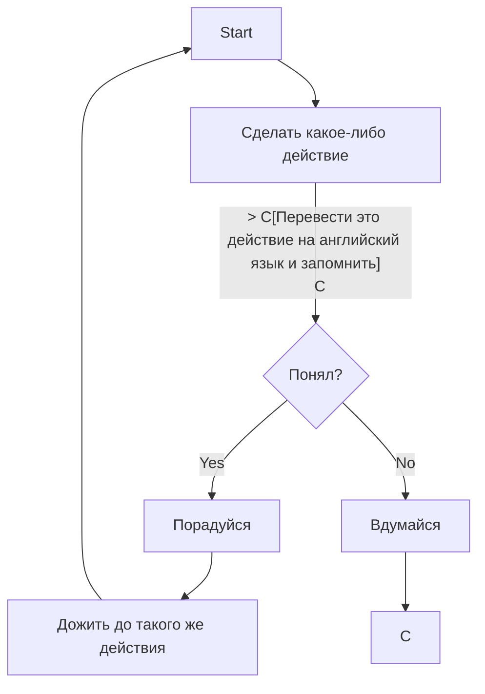

# Как вообще учить английский язык?

Если бы я знал...
Ну а если серьёзно, то существует огромное множество различных методик изучения языка (причём любого). Рассмотрим наилучший, сложнейший
для мозга, но легчайший по времени.

# Изучение с полного нуля

## Введение в язык

Английский язык - язык германской группы, но в отличии от своих братьев и сестёр, потерял все падежи, склонения и рода. Его главной особенностью
является разнообразие форм времён (14 форм, но времён всего 3!!!). Однако это ещё не очень много. Во французском их порядка 16-ти.
Язык использует латинский алфавит

## Roadmap таблица

|Уровень языка|Сколько времени|Знания|
|:-----------:|--------------:|-----:|
|`A1`|~50 hours|Вы **узнаете** базовые фразы и уже сможете **строить** в голове предложения + неплохой слух|
|`A2`|~100 hours|Вы уже сможете **разговаривать** с иностранцами на бытовые темы|
|`B1`|~150 hours|Вы начинаете **читать** лёгкую литературу и **смотреть** простые фильмы, сериалы|

> Для хорошего обучения не требуется учиться где-либо. Самостоятельное обучение - самое эффективное.

## Что нужно иметь для начала обучения?

1. Толстая тетрадочка
2. Ручки чёрные
3. Доступ в интеренет
4. Маркеры-выделители
5. 20 минут в день

## Алгоритм жизни с желанием учить язык

## Алгорим жизни без желания учить язык

